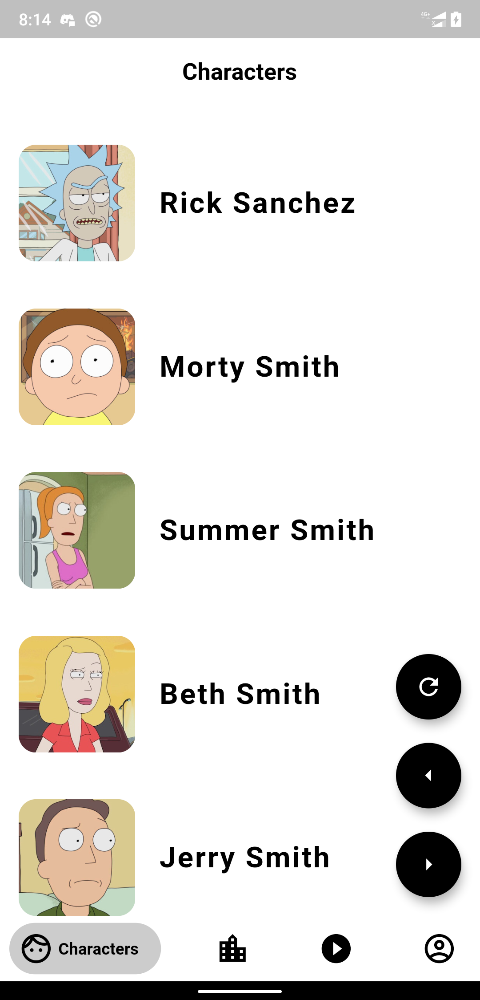
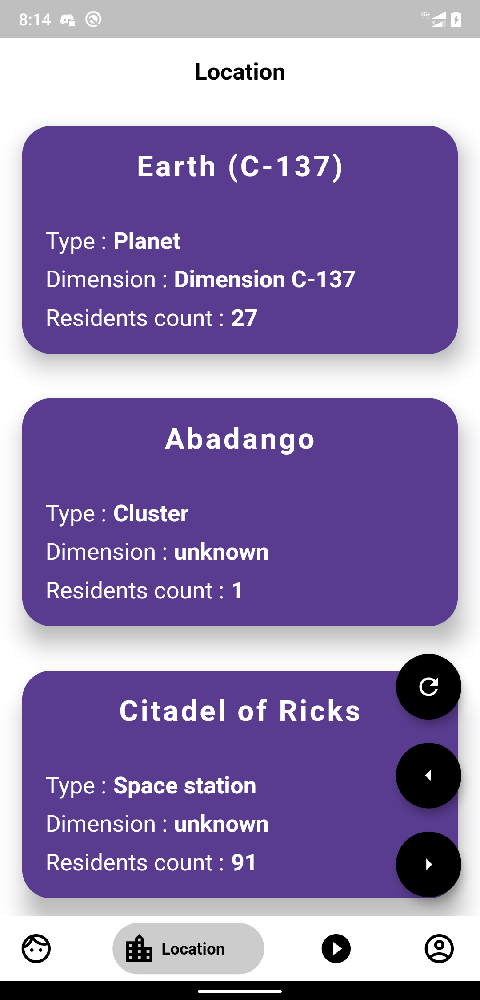
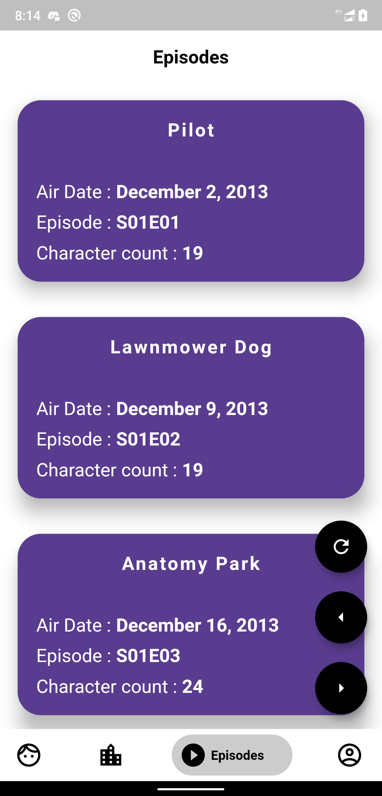
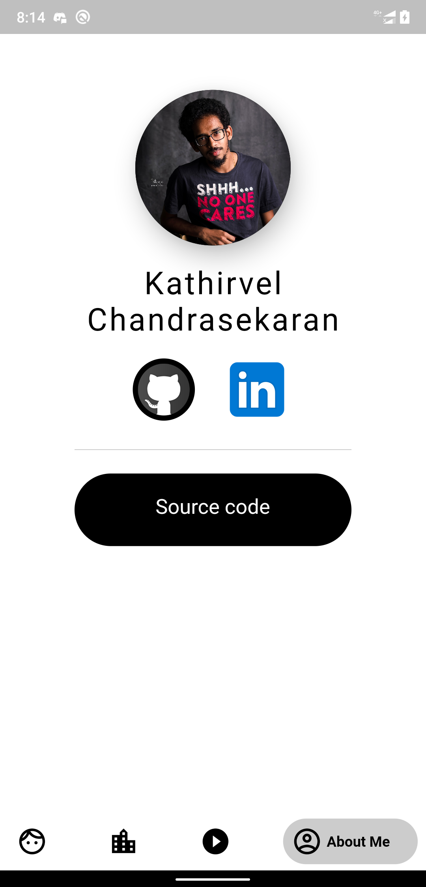

# Rick and Morty

A new Flutter application about the famous Rick and Morty show.

## API Used

API used to develop the app is [Rickandmortyapi](https://rickandmortyapi.com/documentation/#rest).

## Screen Shots

### Character Screen

### Location Screen

### Episodes Screen

### About Me Screen

> Feel free to fork the project.
